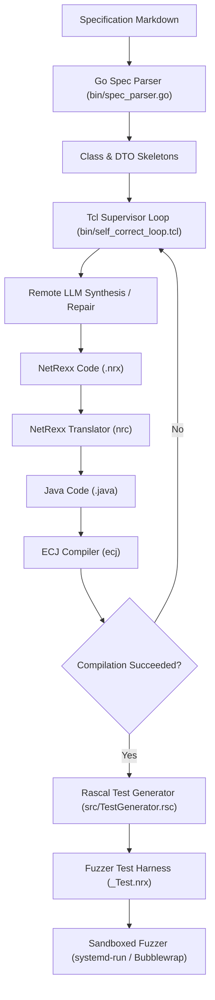

# Architectural Introduction and Tutorial: The `j9mpl` Software Factory

Welcome to `j9mpl`—a high-integrity, local-first software manufacturing plant. This document serves as a comprehensive tutorial and guide to the architecture, philosophy, and operational patterns of the `j9mpl` toolchain.

---

## 1. Architectural Philosophy

Contemporary AI engineering and LLM orchestration are dominated by heavy, abstraction-laden Python frameworks (e.g., LangChain, AutoGen) that run on complex virtual environments.

`j9mpl` rejects this paradigm. To preserve **mechanical sympathy, deterministic execution, and minimalist robustness**, the platform is built on a lean, high-integrity stack:
* **Go (`bin/spec_parser.go`)**: Used for parsing markdown specifications, exporting declarations, and generating type manifests.
* **Tcl (`bin/job_queue.tcl`, `bin/self_correct_loop.tcl`)**: Drives the supervisor logic, orchestrates workspaces, and monitors compilation/fuzzing execution.
* **NetRexx**: The target JVM language, blending REXX's simplicity, powerful string/decimal manipulation (`Rexx` type), and Java's performance/portability.
* **SQLite**: Used for data-oriented transaction scripting and maintaining the fuzzer's unified exemplar ledger.

---

## 2. Toolchain Dataflow

The compilation, synthesis, and verification pipeline follows a strict loop-closed path:



---

## 3. Core Components Walkthrough

### A. The Specification Parser (Go)
The Go spec parser ([spec_parser.go](file:///home/me/code/j9mpl/bin/spec_parser.go)) takes a specification Markdown file (such as [MetricsLoggerSpec.md](file:///home/me/code/j9mpl/generated/MetricsLoggerSpec.md)) and:
1. Extracts required interfaces, invariants, and DTO requirements.
2. Generates initial class skeletons.
3. Queries SQLite to extract fuzzer boundaries from the `unified_exemplars` ledger, exporting them to [.context/fuzzer_boundaries.json](file:///home/me/code/j9mpl/.context/fuzzer_boundaries.json).

### B. The Supervisory Self-Correction Loop (Tcl)
The Tcl supervisor ([self_correct_loop.tcl](file:///home/me/code/j9mpl/bin/self_correct_loop.tcl)) coordinates the remote LLM synthesis and repair process:
1. It translates `.nrx` files to `.java` using `nrc` (NetRexx Translator) with `-nocompile -keepasjava`.
2. It compiles the generated `.java` file using `ecj` (Eclipse Compiler for Java).
3. If compilation fails, the compiler diagnostics (errors/warnings) are captured and processed by `bin/self_correct`.
4. A repair prompt is generated and sent to the LLM. The code is patched and retried until a zero-error build is achieved.

### C. Metaprogramming & Test Generation (Rascal)
Once the main class compiles, the Rascal test generator ([TestGenerator.rsc](file:///home/me/code/j9mpl/src/TestGenerator.rsc)):
1. Reflects on the class declarations from the database ledger.
2. Ingests boundary conditions (SQL injections, path traversals, numerical boundaries, nulls) from [.context/fuzzer_boundaries.json](file:///home/me/code/j9mpl/.context/fuzzer_boundaries.json).
3. Generates a property-based test harness (`*_Test.nrx`) that exhaustively checks all bounds.

### D. Sandboxed Fuzzing (systemd-run / Bubblewrap)
The generated test harness runs inside a restricted user scope:
```bash
systemd-run --user --scope --description=Factory-Fuzzer-Sandbox -p MemoryMax=512M -p CPUQuota=50% -p TasksMax=100 ...
```
This isolates the fuzzer execution, ensuring that malicious inputs (like path traversal attempts or resource depletion payloads) cannot escape into the host environment.

---

## 4. Key NetRexx & Toolchain Gotchas

> [!IMPORTANT]
> Keep these critical constraints in mind when writing or refining code in the `j9mpl` environment.

1. **One Public Class Per File**: A NetRexx source file can contain multiple classes, but only one class can be declared `public`, and its name must exactly match the source file name (e.g. `MetricsLogger.nrx` can only declare `class MetricsLogger public`).
2. **VS Code Editor Diagnostics**: Standard IDE extensions resolve types by looking for file names matching the classes.
   * If a class is declared inside another file (e.g. `class MetricRecord shared` inside `MetricsLogger.nrx`), VS Code flags it as an `unknown variable` in test harnesses.
   * **The Solution**: Extract DTO classes into their own dedicated files (e.g., [MetricRecord.nrx](file:///home/me/code/j9mpl/generated/MetricRecord.nrx) and [TransactionRecord.nrx](file:///home/me/code/j9mpl/generated/TransactionRecord.nrx)) and compile them first.
3. **Tcl Command Substitutions**: Inside double quotes in Tcl, square brackets `[` and `]` trigger command substitutions. Always escape them (e.g. `\[ERROR\]`) or use braces `{}`.
4. **Short-Circuiting Safety**: In NetRexx, the logical AND operator `&` translates to Java's bitwise `&` (which does not short-circuit). To prevent `NullPointerException`s, always use nested `if` blocks instead of `&` for checking null bounds.
   ```rexx
   -- INSECURE (causes NullPointerException if obj is null)
   if obj \== null & obj.isValid() then say "valid"

   -- SECURE (properly short-circuited)
   if obj \== null then if obj.isValid() then say "valid"
   ```

---

## 5. Running a Workspace Build
To run a clean build and verify all specifications:
```bash
# Executing the supervisor job queue
tclsh bin/job_queue.tcl generated/TransactionRouterSpec.md generated/MetricsLoggerSpec.md
```
This command automatically manages isolated build workspaces, parses specifications, compiles files, generates test scripts, runs fuzzing validations, and merges successful results back into your workspace.
