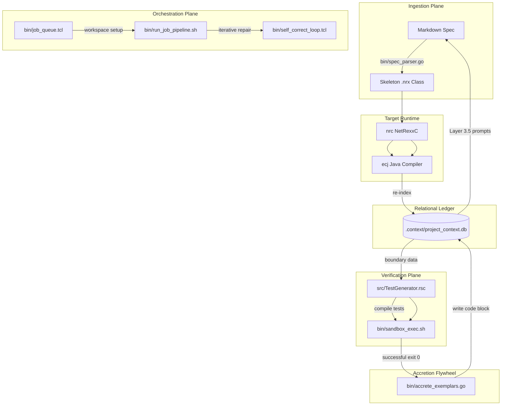

# Workspace Directory Map & Architecture Guide

This guide provides a structural mapping of the `j9mpl` software manufacturing plant, outlining directory layouts, toolchain orchestration paths, and database ledger structures.

---

## 1. Directory Tree Map

```
/home/me/code/j9mpl/
├── .context/                      # Relational Ledger Context Folder
│   ├── project_context.db         # Main SQLite ledger containing AST tables & unified exemplars
│   └── extracted.sql              # Temporary SQL import buffers from Rascal parser
├── bin/                           # Control Plane Executables & Script Supervisor
│   ├── accrete_exemplars          # Compiled Go accretion flywheel utility
│   ├── accrete_exemplars.go       # Source code for the accretion utility
│   ├── job_queue.tcl              # Parallel workspace queue supervisor (master runner)
│   ├── run_job_pipeline.sh        # Workspace shell runner (parses, compiles, generates tests)
│   ├── sandbox_exec.sh            # Executes generated tests inside systemd/bubblewrap sandbox
│   ├── self_correct               # Compiled Go self-correction prompt formatter
│   ├── self_correct.go            # Source code for translating ECJ errors into repairs
│   ├── self_correct_loop.tcl      # Script managing iterative synthesis retries
│   ├── spec_parser                # Compiled Go spec-to-skeleton parser
│   └── spec_parser.go             # Source code for spec parser & Layer 3.5 prompt builder
├── generated/                     # Workspace Production Code & DTOs
│   ├── com/factory/               # Package-compliant symlinks for IDE type resolution
│   │   ├── metrics/               # MetricRecord & MetricsLogger symlinks
│   │   ├── routing/               # TransactionRecord & TransactionRouter symlinks
│   │   └── telemetry/             # TelemetryEngine symlinks
│   ├── MetricsLoggerSpec.md       # Ingestion spec for MetricsLogger
│   ├── MetricsLogger.nrx          # Synthesized MetricsLogger source
│   ├── MetricRecord.nrx           # Extracted Metric DTO properties
│   └── TransactionRouterSpec.md   # Ingestion spec for TransactionRouter
├── src/                           # Static Metaprogramming & Analysis Core
│   ├── ContextExtractor.rsc       # Rascal AST-to-M3 SQL database indexer
│   └── TestGenerator.rsc          # Rascal property-based fuzzer generator
├── target/                        # Compiled class dependency libraries
│   └── dependency/                # SQLite-JDBC and SLF4J library jar files
├── pom.xml                        # Maven dependency config and IDE source root definition
└── rascal-shell-stable.jar        # Rascal standalone compiler runtime
```

---

## 2. Subsystem Mapping



---

## 3. Core Database Tables (`project_context.db`)

* **`declarations`**: Indexes every class, method, field, and parameter, mapping symbols back to source files and line ranges.
* **`containment`**: Tracks nested relational scopes (which methods belong to which classes).
* **`unified_exemplars`**: Holds:
  1. `Language.Grammar` (`NETREXX_GRAMMAR_BASICS`) - Basic NetRexx syntax structures.
  2. `Database.SQLite` - Example query setups.
  3. `Fuzzer.Boundary` - JSON arrays representing invalid parameters, SQL injection vectors, and path traversals.
  4. `Implementation.NetRexx` - Machine-verified production methods accreted during successful pipeline runs.

---

## 4. Key Developer Commands

### Running the Entire Pipeline
To ingest a new specification and run it through compilation, test generation, and sandboxed fuzzing:
```bash
tclsh bin/job_queue.tcl generated/TransactionRouterSpec.md
```

### Checking the Exemplar Ledger
To view currently accreted, machine-verified NetRexx implementations:
```bash
sqlite3 .context/project_context.db "SELECT exemplar_id, fact_context_predicate FROM unified_exemplars WHERE domain_scope = 'Implementation.NetRexx'"
```

### Re-indexing the Main Ledger manually
If you modify source code directly and need the database to update its symbol mappings:
```bash
java -cp "rascal-shell-stable.jar:target/dependency/*" org.rascalmpl.shell.RascalShell ContextExtractor $(pwd) .context/extracted.sql
sqlite3 .context/project_context.db < .context/extracted.sql
```
